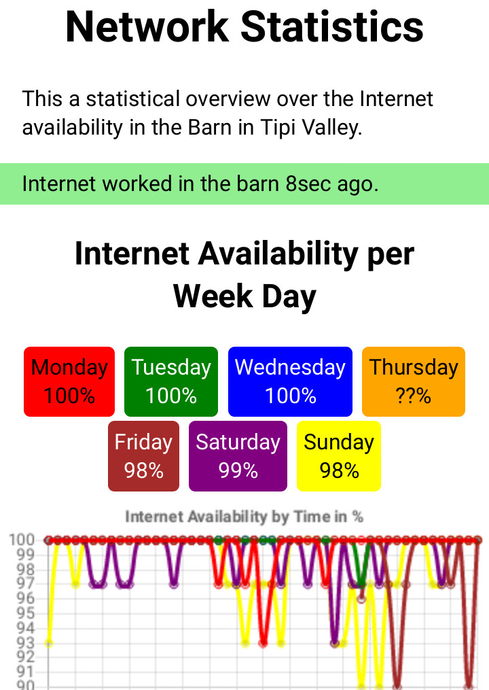

Network Status Monitor
======================



This is a simple background monitor which creates statistics
about how the network is behaving.
It can run as a background job on a raspberry pi or
an openWRT router.

Features:

- Internet availibility check using ping
- Internet availibility check using wget
- Checking if certain MAC-adresses can be reached
- traceroute to see where the traffic stops

Installation
------------

Clone this repository.

Then, make it run at startup, see
[here](https://www.dexterindustries.com/howto/auto-run-python-programs-on-the-raspberry-pi/)
for example.
I use crontab:

```
crontab -e
```

Then, I added this line:

```
@reboot /home/pi/network-status-monitor/bin/background
```

Packages
--------

Commands used:
- `wget`
- `curl`
- `python3` for the server, not required to just record statistics
- `ip`
- `traceroute`
- `bash`
- `ping`
- `git` for updating/cloning
- `iwlist` as `/sbin/iwlist` for listing WIFI networks

Also used bu usually there:
`dirname`, `cd`, `mkdir`, `seq`

Server
------

You can use the Python3 CGI server to serve the statistics.

Implementation
--------------

We use [chart.js](https://www.w3schools.com/ai/ai_chartjs.asp).


